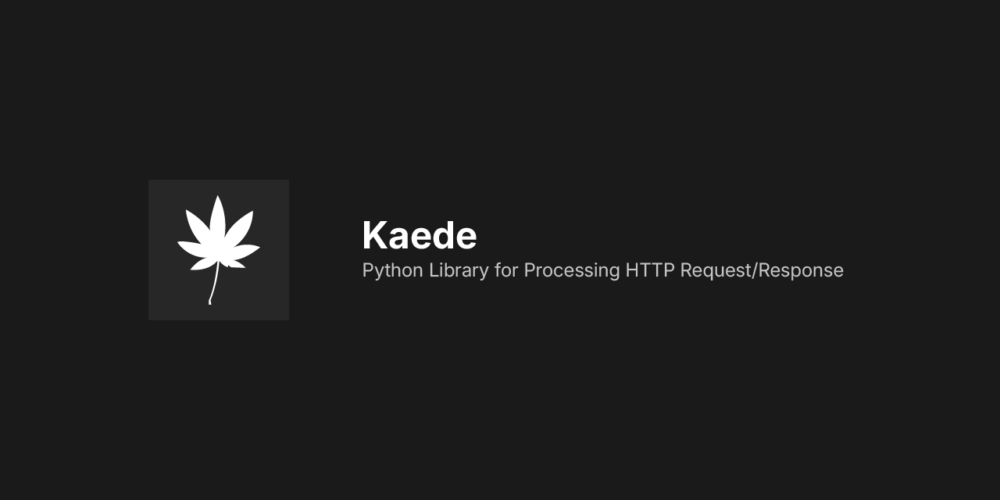

> [!IMPORTANT]
> リライト作業中です。

# Kaede
TCP、UDP、HTTPのような一般的なプロトコルを扱うためのPythonライブラリ

## システム要件
- Linux / macOS
- CPython 3.9+
- OpenSSL 3.6+ or 4.0+

### Windowsへの対応について

Windowsへの対応は予定していません。
ただし、未検証ですがuvloopを除去しlibssl/libcryptoの読み込み部分を拡張すればWindowsでも動作すると思います。

## プロトコル

### UDS
標準ライブラリのラッパーとして実装します。

### TCP
標準ライブラリのラッパーとして実装します。

### UDP
標準ライブラリのラッパーとして実装します。

### QUIC
KaedeのUDP/TLSモジュールを使用して実装します。

### HTTP
KaedeのUDS/TCP/QUIC/TLSモジュールを使用して実装します。

### SMTP
KaedeのTCP/TLSモジュールを使用して実装します。

### IMAP
KaedeのTCP/TLSモジュールを使用して実装します。

### POP3
KaedeのTCP/TLSモジュールを使用して実装します。

### DNS
KaedeのTCP/UDP/QUIC/HTTP/TLSモジュールを使用して実装します。
